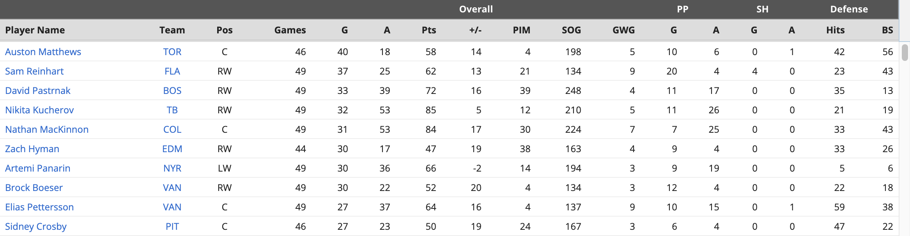
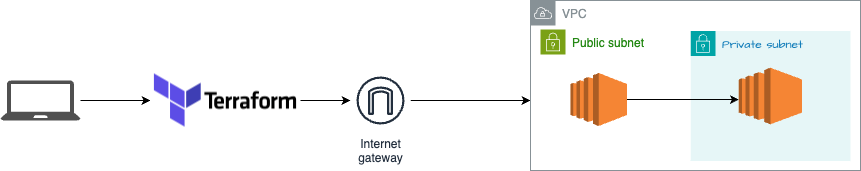

# API's and Databases

## Overview

This project utilizes Terraform to provision an AWS infrastructure consisting of a VPC, a public subnet with two nodes, a NAT gateway, an S3 bucket, and a private subnet housing a database. Additionally, it includes two containerized applications: one that populates a MySQL server running in the private EC2 instance and another that sets up endpoints for querying the private database from the public EC2 instance. The primary objective of this project is to access the public EC2 IP over HTTP and utilize four endpoints to observe real-time results queried from the pre-seeded database.

## Endpoints

The project exposes four endpoints:

1. `/` - Returns the first 10 rows of the database.
2. `/players` - Retrieves information on the first 10 players.
3. `/toronto` - Displays details of all Toronto Maple Leafs players.
4. `/points` - Shows the top 10 players with the highest number of points scored.

## Data

The data utilized in this project was sourced from the year 2023 and obtained from Rotowire.

Example format:



## Architecture



## Prerequisites

Before proceeding, ensure you have the following prerequisites installed:

- [Terraform](https://developer.hashicorp.com/terraform/install) (version 0.15.0)
- [Python](https://docs.python.org/3/using/index.html)
- [Pip](https://pip.pypa.io/en/stable/installation/)

## How to run

To run the project:

Export your environment variables or create them in a .tfvars file: AWS_REGION, AWS_PROFILE, KEY_PAIR_NAME.
Execute the following commands:

```sh
$ terraform plan
$ terraform apply --auto-approve
```

To destroy the resources afterward:

```sh
$ terraform destroy --auto-approve
```

- Access the public IPv4 address of the EC2 instance created: Visit `http://<your-aws-public-ip-address>` to view the first 10 rows of the dataset.
- Navigate to:
  - `http://<your-aws-public-ip-address>/players` to see details on the first 10 players.
  - `http://<your-aws-public-ip-address>/toronto` to explore information about all Toronto Maple Leafs players.
  - `http://<your-aws-public-ip-address>/points` to discover the top 10 players with the highest points scored.

## URL to public GitHub repo

https://github.com/LaraTunc/wcd-5-apis-databases

## Docker Images

FastApi endpoints: https://hub.docker.com/repository/docker/laratunc/fastapi_app/general
MySql seeder: https://hub.docker.com/repository/docker/laratunc/mysql_app/general

## Building multi platform images

https://docs.docker.com/build/building/multi-platform/
